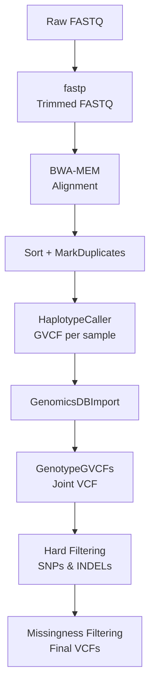

# Variant Calling Pipeline (Snakemake)

This repository contains a Snakemake workflow for **FASTQ → trimmed FASTQ → BAM → GVCF → joint genotyping → filtered VCFs** using **fastp**, **BWA‑MEM**, **GATK4**, and optional downstream filtering.  
It is designed for reproducible variant calling of multiple samples on an HPC cluster or workstation.

---

##  Pipeline Overview (Step-by-step)

1. **FASTQ trimming with fastp**  
   Removes low‑quality bases, adapters, and produces QC reports.

2. **Alignment to reference genome using BWA‑MEM**  
   Produces sorted BAM files.

3. **Marking duplicates**  
   Removes PCR duplicates and prepares BAMs for variant calling.

4. **GVCF creation per sample (GATK HaplotypeCaller)**  
   Each sample is processed independently.

5. **GenomicsDBImport (joint calling database)**  
   All GVCFs are combined into a single database.

6. **Joint genotyping (GATK GenotypeGVCFs)**  
   Produces a multi‑sample raw VCF.

7. **SNP and INDEL filtering**  
   Hard filters + optional depth/AD filtering.

8. **Final VCF creation**  
   Missingness filters are applied → final SNP and INDEL VCFs.

---

##  Suggested Workflow Diagram (Mermaid)

You can paste this directly into your README on GitHub:



---

##  Repository Structure

```
config/               # config.yaml and samples.tsv
workflow/             # Main snakemake directory
workflow/Snakefile    # Main workflow file
workflow/rules/       # Modular rule files
cmd.unix              # Optional cluster command example
```

---

##  Sample Sheet Format

A tab‑separated file:

```
sample    fq1                 fq2
Sample1   Sample1_R1.fq.gz    Sample1_R2.fq.gz
Sample2   Sample2_R1.fq.gz    Sample2_R2.fq.gz
```

---

##  Configuration File (config.yaml)

A typical configuration file looks like:

```yaml
ref: "/path/to/reference.fasta"
samples_tsv: "/path/to/samples.tsv"
outdir: "/path/to/output_dir"

# Thread settings
bwa_threads: 12
markdup_threads: 8
hc_threads: 1

# Variant filtering thresholds
filter:
  snp: "QD < 5.0 || FS > 30.0 || MQ < 50 || MQRankSum < -8"
  indel: "QD < 5.0 || FS > 200.0"

# Additional final filtering
final:
  sample_max_missing: 0.2   # Remove samples with >20% missing
  max_missing: 0.5          # Remove sites missing in >50% samples
```

### Explanation of important fields

| Field | Description |
|-------|-------------|
| `ref` | Path to the reference genome FASTA file. |
| `samples_tsv` | Path to sample sheet listing sample name and FASTQ files. |
| `outdir` | Output directory where all BAM, GVCF, and VCFs will be stored. |
| `*_threads` | Number of threads used by individual rules. |
| `filter.snv` / `filter.indel` | Hard‑filtering thresholds applied by GATK. |
| `final.sample_max_missing` | Removes low‑quality samples from final dataset. |
| `final.max_missing` | Removes poorly represented sites. |

---

##  Running the Pipeline

```
snakemake --use-conda --cores 32 \
    --printshellcmds --latency-wait 30  \
    --keep-going --rerun-incomplete \
    --configfile config/config.yaml
```

---

##  Outputs

- Trimmed FASTQ files (`fastp`)
- BAM files (`sorted + markdup`)
- GVCFs per sample
- Joint‑called multi-sample VCF
- Filtered SNP and INDEL VCFs

---

##  Troubleshooting

- Dry run:
  ```
  snakemake -n
  ```
- Visualize workflow:
  ```
  snakemake --debug-dag
  ```
- Generate DAG graph:
  ```
  snakemake --rulegraph | dot -Tpng > dag.png
  ```

---

## 👥 Maintainer

Verstrepen Lab — KU Leuven  
https://verstrepenlab.sites.vib.be/en  
Contact: **michael.abrouk@kuleuven.be**

